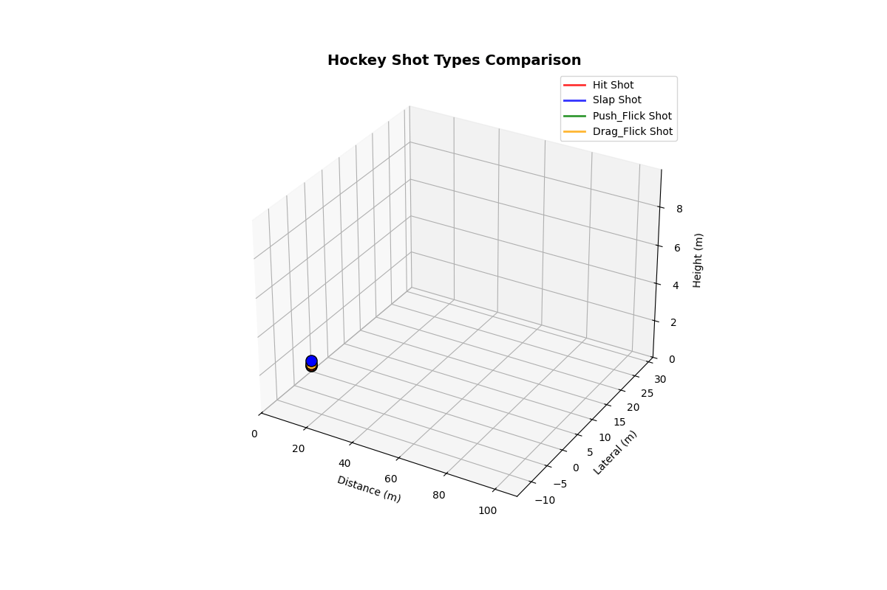

# Hockey Shot Classification System

**Complete Physics-Informed ML Pipeline for Hockey Shot Analysis**

[]()
[]()
[]()

**Author:** [Ritabrata Chakraborty](https://ritabrata-chakraborty.github.io/Portfolio/) \
**Dataset:** 4000 procedurally generated shots (1000 per class) \
**Best Model:** TCN with 95% test accuracy

---

## Quick Start

```bash
# Activate environment
source venv/bin/activate

# 1. Generate trajectory data (4000 shots)
./scripts/generate.sh 1000

# 2. Analyze and visualize data
./scripts/analyze.sh

# 3. Train all 5 models (TCN, XGBoost, RF, SVM, KNN)
./scripts/train.sh

# 4. Test models with visualizations
./scripts/test_single.sh

# 5. Run shot correction system
./scripts/control.sh tcn hit
```

---

## Table of Contents

1. [Overview](#overview)
2. [Directory Structure](#directory-structure)
3. [Physics & Mathematics](#physics--mathematics)
4. [Procedural Generation](#procedural-generation)
5. [Machine Learning Models](#machine-learning-models)
6. [Control System](#control-system)
7. [Usage Guide](#usage-guide)
8. [Installation](#installation)
9. [Future Work](#future-work)

---

## Overview

An end-to-end system for hockey shot classification combining:
- **Physics-based trajectory generation** with environmental effects
- **Deep learning (TCN)** and classical ML models (XGBoost, RF, SVM, KNN)
- **PID control system** for real-time shot correction
- **Comprehensive visualizations** and statistical analysis

### Shot Types

| Shot Type | Characteristics |
|-----------|----------------|
| **Hit/Drive** | Fast (30-45 m/s), low trajectory (~12°), long range (~130m) |
| **Slap** | Most powerful (40-55 m/s), nearly flat (~15°), short range (~15m) |
| **Push/Flick** | Controlled (25-32 m/s), medium arc (~18°), balanced (~60m) |
| **Drag Flick** | High arc (28-38 m/s, ~22°), maximum spin (~35 rad/s), medium range (~45m) |

### Key Features

- **Physics-accurate trajectory simulation** with drag, Magnus force, wind, turbulence  
- **652 engineered features** (600 temporal + 52 auxiliary)  
- **5 ML models** with comprehensive comparison  
- **95% test accuracy** with TCN architecture  
- **Real-time PID control** for shot correction  
- **Production-ready pipeline** with shell scripts

---

## Directory Structure

```
Procedural/
├── data/                          # Generated trajectory CSV files
│   └── hockey_shots_*.csv
├── analysis/
│   ├── statistics/                # Statistical plots & reports
│   │   ├── performance_overview.png
│   │   ├── statistical_comparison.png
│   │   └── statistical_report.txt
│   └── animations/                # 3D trajectory animations
│       └── shot_types_comparison.gif
├── models/
│   ├── checkpoints/               # Trained models
│   │   ├── best_tcn_model.pth
│   │   ├── xgboost_model.pkl
│   │   ├── svm_model.pkl
│   │   ├── random_forest_model.pkl
│   │   ├── knn_model.pkl
│   │   ├── comparison_table.csv
│   │   └── comprehensive_comparison.png
│   ├── training_results/          # Training curves & metrics
│   │   ├── training_curves.png
│   │   └── confusion_matrix.png
│   ├── control_results/           # Control system outputs
│   ├── batch_test_results/        # Batch confusion matrices
│   └── single_test_results/       # 3D trajectory visualizations
├── scripts/                       # Shell scripts for workflows
│   ├── generate.sh
│   ├── analyze.sh
│   ├── train.sh
│   ├── test_single.sh
│   ├── test_batch.sh
│   └── control.sh
└── src/                           # Python source code
    ├── physics/                   # Physics simulation
    │   ├── shot_logical.py
    │   ├── effects_simulation.py
    │   ├── procedural_shot_generation.py
    │   ├── statistical_plots.py
    │   └── animation_display.py
    ├── classifiers/               # ML models
    │   ├── tcn_model.py
    │   ├── ml_trainer.py
    │   ├── feature_extraction.py
    │   ├── train_all.py
    │   └── test_models.py
    └── control_system/            # Control system
        ├── shot_control.py
        └── run_control.py
```

---

## Physics & Mathematics

### 1. Hit/Drive Shot

**Physical Model:** 1D Elastic Collision

**Equations:**
```
v_ball = (2 × m_stick × v_stick0 + (m_ball - m_stick) × v_ball0) / (m_stick + m_ball)
F_avg = m_ball × (v_ball - v_ball0) / Δt
E_kinetic = 0.5 × m_ball × v_ball²
```

**Parameters:**
- `m_stick`: Stick mass (kg) ∈ [0.5, 0.7]
- `v_stick0`: Initial stick velocity (m/s) ∈ [25, 45]
- `v_ball0`: Initial ball velocity (m/s) ∈ [0, 2]
- `Δt`: Contact time (s)
- `m_ball`: Ball mass = 0.156 kg

---

### 2. Slap Shot

**Physical Model:** Elastic Energy Transfer

**Equations:**
```
PE_stored = 0.5 × k × x²
v_ball = √(2 × PE_stored / m_ball)
F_avg = m_ball × v_ball / Δt
```

**Parameters:**
- `k`: Stick stiffness (N/m) ∈ [2000, 5000]
- `x`: Stick deflection (m) ∈ [0.06, 0.15]
- `Δt`: Contact time (s)

---

### 3. Push/Flick Shot

**Physical Model:** Constant Acceleration Kinematics

**Equations:**
```
v_ball = a × t
s = 0.5 × a × t²
E_kinetic = 0.5 × m_ball × v_ball²
F_avg = m_ball × a
```

**Parameters:**
- `a`: Acceleration (m/s²) ∈ [80, 200]
- `t`: Stroke duration (s) ∈ [0.15, 0.30]
- `Δt`: Contact time (s)

---

### 4. Drag Flick Shot

**Physical Model:** Rotational Biomechanics

**Equations:**
```
ω = α × t
v_tip = L × ω
v_ball = η × v_tip
F_avg = m_ball × v_ball / Δt
E_kinetic = 0.5 × m_ball × v_ball²
```

**Parameters:**
- `α`: Angular acceleration (rad/s²) ∈ [80, 160]
- `L`: Stick length (m) ∈ [0.9, 1.2]
- `t`: Flick duration (s) ∈ [0.18, 0.28]
- `η`: Energy transfer efficiency ∈ [0.75, 0.95]
- `ω`: Angular velocity (rad/s)

---

### Advanced Trajectory Physics

#### Stick Flex Enhancement
```
flex_energy_factor = 1.0 + (stick_flex × contact_time × 100)
biomech_factor = 0.9 + (player_strength - 1.0) × 0.4
v_enhanced = v_base × min(flex_energy_factor × biomech_factor, 1.5)
```

**Enhancements:**
- Stick flex coefficient: 0.10-0.25
- Contact time: 0.005-0.012 s
- Player strength: 0.7-1.3 (normalized)

---

#### Forces Acting on Ball

**1. Gravity:**
```
F_gravity = (0, 0, -m_ball × g)  where g = 9.81 m/s²
```

**2. Drag Force (Reynolds-dependent):**
```
Reynolds Number: Re = (ρ × v × 2r) / μ

Cd = {
  24/Re,             if Re < 10³
  0.47,              if 10³ ≤ Re < 10⁵
  0.47 - 0.3×f(Re),  if 10⁵ ≤ Re < 3×10⁵
  0.17,              if Re ≥ 3×10⁵
}

F_drag = -0.5 × ρ × Cd × A × v² × (v/|v|)
```

**3. Magnus Force (Spin Effect):**
```
F_magnus = 0.5 × ρ × A × C_magnus × (ω × v)

where:
- C_magnus = 0.25 (Magnus coefficient)
- ω: spin angular velocity vector
- Spin decay: ω(t) = ω₀ × (0.95)^t
```

**4. Wind Effect:**
```
v_relative = v_ball - v_wind
F_wind = 0.5 × ρ × Cd × A × |v_relative|² × (-v_relative/|v_relative|)
```

**5. Turbulence (Stochastic):**
```
F_turbulence = I_turb × [
  A_turb × sin(2x + 3t) × cos(2y),
  A_turb × cos(2y + 2t) × sin(2z),
  A_turb × sin(2z + t) × cos(2x)
]
where I_turb is turbulence intensity (0-0.5)
```

**Environmental Conditions:**
- Air density: ρ = (P × M) / (R × T) × (1 - 0.378 × e_vapor / P)
- Temperature: 10-30°C
- Humidity: 0.3-0.9
- Pressure: 85000-101325 Pa
- Wind velocity: (0-5, 0-2, 0) m/s

**Numerical Integration (Euler Method):**
```
a(t) = F_total / m_ball
v(t + Δt) = v(t) + a(t) × Δt
r(t + Δt) = r(t) + v(t) × Δt + 0.5 × a(t) × Δt²

Time step: Δt = 0.01 s
```

**Shot-Specific Spin Parameters:**
- **Hit Shot:** ω = 15 rad/s, axis = (0.2, 0.1, 0.97)
- **Slap Shot:** ω = 25 rad/s, axis = (0.1, 0.0, 0.99)
- **Push/Flick:** ω = 10 rad/s, axis = (0.0, 0.3, 0.95)
- **Drag Flick:** ω = 35 rad/s, axis = (0.3, 0.2, 0.93)

---

## Procedural Generation

### Randomly Generated Variables

**For Each Shot (1000 per type):**

1. **Base Physics Parameters** (from ranges above)
   - Shot-specific parameters sampled from defined ranges
   
2. **Biomechanical Enhancements:**
   - `stick_flex` ∈ Uniform[0.10, 0.25]
   - `contact_time` ∈ Uniform[0.005, 0.012] s
   - `player_strength` ∈ Gaussian(μ=1.0, σ=0.15), clipped to [0.7, 1.3]

3. **Launch Parameters:**
   - `launch_angle` ∈ Uniform[base_angle - 3°, base_angle + 3°]
     - Hit: 12°, Slap: 15°, Push/Flick: 18°, Drag Flick: 22°
   - `launch_height` ∈ Uniform[0.3, 0.7] m
   - `lateral_angle` ∈ Uniform[-20, 20]°

4. **Environmental Conditions** (probabilistic):
   - **Calm** (60%): standard conditions
   - **Windy** (20%): wind = (3.0, 1.5, 0.0) m/s, turbulence = 0.3
   - **Humid** (20%): T = 30°C, humidity = 0.9, P = 101000 Pa

### Distribution Strategies

- **Force/Velocity:** Gaussian (favors medium values)
- **Time:** Triangular (favors shorter times)
- **Angles:** Gaussian (favors middle angles)
- **Length/Distance:** Triangular (favors medium-high values)

### Trajectory Generation Pipeline

```
For each shot (1000 per type):
  1. Sample random parameters from distributions
  2. Calculate base velocity from physics model
  3. Apply biomechanical enhancements
  4. Select environmental conditions
  5. Simulate 3D trajectory with all forces
  6. Resample to 200 timesteps (fixed length)
  7. Store trajectory points (time, x, y, z)
```

**Result:** 4000 unique, physically realistic trajectories with natural variation.

---

## Trajectory Visualization

### Shot Types Comparison Animation



**Animation Details:**
- **4 trajectories:** One representative shot per type
- **3D visualization:** Shows full spatial trajectory
- **Color coding:** Hit (Blue), Slap (Orange), Push/Flick (Green), Drag Flick (Red)
- **Rotation:** 360° view over 10 seconds
- **Key observations:**
  - Hit shot: longest range, low arc
  - Slap shot: shortest, nearly flat
  - Push/Flick: balanced arc
  - Drag Flick: highest arc, medium range

---

## Machine Learning Models

### Feature Engineering

**Total Features: 652**

#### Temporal Features (600)
- **Raw trajectory:** x, y, z coordinates over 200 timesteps
- **Preprocessing:** Apex-centered alignment
  - Split trajectory at maximum height
  - Resample ascent phase to 100 points
  - Resample descent phase to 100 points
  - Per-axis normalization: z_axis = (x - μ_axis) / σ_axis

#### Auxiliary Features (52)

**Grouped by Category:**
- **Spatial (10):** max_range, max_height, max_lateral, landing_distance, landing_height, path_length, x_range, y_range, z_range, volume_enclosed
- **Temporal (5):** flight_time, time_to_peak, ascent_time, descent_time, time_ratio
- **Velocity (8):** initial_speed, max_speed, final_speed, avg_speed, speed_std, speed_range, vz_initial, vz_final
- **Acceleration (6):** max_acceleration, avg_acceleration, max_deceleration, acceleration_changes, vertical_accel_avg, lateral_accel_avg
- **Angular (6):** launch_angle, landing_angle, max_elevation_angle, avg_elevation_angle, azimuth_variance, avg_curvature
- **Energy (4):** initial_kinetic_energy, max_potential_energy, total_energy, energy_loss_rate
- **Shape (8):** max_curvature, straightness, spin_rate_estimate, wobble, apex_position_ratio, symmetry_score, arc_completeness, vertical_efficiency
- **Statistical (5):** x_entropy, velocity_entropy, smoothness, variance_x, variance_z

---

### Model Architectures

#### 1. TCN (Temporal Convolutional Network) - Best Performance

**Architecture:**
```
Input: [Temporal: 3×200, Auxiliary: 52]

Stage 1: Trajectory Encoder
├── Stem: Conv1d(3→16→32) + ReLU
├── Residual Blocks (5 layers):
│   ├── Block 1: dilation=1,  RF=5
│   ├── Block 2: dilation=2,  RF=13
│   ├── Block 3: dilation=4,  RF=29
│   ├── Block 4: dilation=8,  RF=61
│   └── Block 5: dilation=16, RF=125
├── Encoder: Conv1d(32→64→128→128→64)
│   └── Downsample: stride=2 (200→50 timesteps)
└── Global Pooling: (avg + max) / 2 → [64]

Stage 2: Auxiliary Encoder
└── MLP: 52→64→32 + ReLU + Dropout

Stage 3: Attention Fusion
├── Attention: Concat[64,32]→64→2 (softmax weights)
├── Weighted: traj×w₁ + aux×w₂
└── Output: [96]

Stage 4: Classifier
└── MLP: 96→128→64→4 + ReLU + Dropout(0.3)

Output: [4 classes]
```

**Hyperparameters:**
- Dropout: 0.15
- Learning rate: 5e-4 (Adam optimizer)
- Batch size: 32
- Epochs: 150
- Weight decay: 1e-4
- Label smoothing: 0.1
- Gradient clipping: 1.0
- LR scheduler: ReduceLROnPlateau (patience=10, factor=0.5)

---

#### 2. XGBoost (Gradient Boosting)
- Features: 652 (flattened temporal + auxiliary)
- Max depth: 7, Learning rate: 0.1
- Estimators: 200, Subsample: 0.8

#### 3. Random Forest
- Estimators: 200, Max depth: 20
- Min samples split: 5

#### 4. SVM (Support Vector Machine)
- Kernel: RBF, C: 10.0, Gamma: scale
- Features: 652 (StandardScaler normalized)

#### 5. KNN (K-Nearest Neighbors)
- Neighbors: 5, Metric: Euclidean
- Features: 652 (StandardScaler normalized)

---

### Performance Comparison

| Model | Train Acc | Val Acc | Test Acc | F1 Score | Time (s) |
|-------|-----------|---------|----------|----------|----------|
| **TCN** | **90.16%** | **88.75%** | **95.00%** | **0.9493** | 98.78 |
| XGBoost | 100.00% | 81.25% | 93.75% | 0.9372 | 7.02 |
| Random Forest | 99.22% | 83.75% | 91.25% | 0.9125 | 3.81 |
| SVM | 92.81% | 87.50% | 90.00% | 0.9003 | 3.45 |
| KNN | 100.00% | 73.75% | 76.25% | 0.7448 | 3.32 |

**Key Insights:**
- **TCN** achieves best test accuracy and F1 score with excellent generalization
- **XGBoost** and **Random Forest** overfit (100% train accuracy)
- **SVM** provides balanced performance
- **KNN** suffers from curse of dimensionality with 652 features

---

### TCN Confusion Matrix (Test Set)

```
              Predicted
Actual      Hit  Slap  Push  Drag
Hit          20    0     0     0   Perfect
Slap          0   20     0     0   Perfect
Push/Flick    2    0    17     1   85% accuracy
Drag Flick    0    0     1    19   95% accuracy

Overall Test Accuracy: 95.0%
```

**Analysis:**
- Perfect classification for Hit and Slap shots
- Minor confusion between Push/Flick ↔ Drag Flick (similar arc patterns)
- Only 3 misclassifications out of 80 test samples

---

## Control System

### Overview

**Purpose:** Real-time shot correction using PID control and classifier feedback

**Capabilities:**
- Detect actual shot type from trajectory
- Analyze deviation from intended shot
- Calculate corrective actions (PID-based)
- Iteratively refine parameters until target achieved
- Handle environmental disturbances

**Compatible Classifiers:** TCN, XGBoost, Random Forest, SVM, KNN

---

### System Architecture

```
┌─────────────────────────────────────────────────────────────┐
│                    SHOT CONTROL SYSTEM                      │
└─────────────────────────────────────────────────────────────┘
                             │
                             ▼
          ┌──────────────────────────────────────┐
          │  1. Shot Execution (with faults)     │
          │     - Base velocity ± error          │
          │     - Launch angle ± error           │
          │     - Spin rate ± error              │
          │     - Environmental disturbances     │
          └──────────────────┬───────────────────┘
                             │
                             ▼
          ┌──────────────────────────────────────┐
          │  2. Trajectory Simulation            │
          │     - 3D physics engine              │
          │     - Environmental effects          │
          │     - Returns trajectory points      │
          └──────────────────┬───────────────────┘
                             │
                             ▼
          ┌──────────────────────────────────────┐
          │  3. Classifier Prediction            │
          │     - Extract 652 features           │
          │     - Predict shot type              │
          │     - Get class probabilities        │
          └──────────────────┬───────────────────┘
                             │
                             ▼
          ┌───────────────────────────────────────┐
          │  4. Deviation Analysis                │
          │     - Compare predicted vs intended   │
          │     - Calculate parameter errors      │
          │     - Deviation score: 1 - P(target)  │
          └──────────────────┬────────────────────┘
                             │
                             ▼
          ┌────────────────────────────────────────┐
          │  5. PID Correction Calculation         │
          │     Δ = -Kp×e - Ki×∫e - Kd×(de/dt)     │
          │                                        │
          │     Gains:                             │
          │     • Velocity: Kp=1.0, Ki=0.2, Kd=0.4 │
          │     • Angle: Kp=0.8, Ki=0.1, Kd=0.3    │
          │     • Spin: Kp=0.6, Ki=0.1, Kd=0.2     │
          └──────────────────┬─────────────────────┘
                             │
                             ▼
          ┌───────────────────────────────────────┐
          │  6. Apply Corrections & Iterate       │
          │     Until deviation < ε (0.15)        │
          │     or max iterations (10) reached    │
          └───────────────────────────────────────┘
```

---

### PID Controller

**Proportional-Integral-Derivative Control:**

```
For parameter p (velocity, angle, spin):

Error: e(t) = p_target - p_actual

Proportional: P = Kp × e(t)      ← Immediate response
Integral:     I = Ki × ∫e(τ)dτ   ← Eliminates steady-state error
Derivative:   D = Kd × de/dt     ← Dampens oscillations

Correction: Δp = -(P + I + D)
Update: p_new = p_old + Δp
```

---

### Reference Parameters

| Shot Type | Velocity (m/s) | Launch Angle (°) | Spin Rate (rad/s) |
|-----------|----------------|------------------|-------------------|
| Hit       | 35.0           | 12.0             | 15.0              |
| Slap      | 45.0           | 15.0             | 25.0              |
| Push/Flick| 28.0           | 18.0             | 10.0              |
| Drag Flick| 32.0           | 22.0             | 35.0              |

---

### Example Correction Workflow

**Scenario:** Intended = "hit", but executed with faults

```
Initial State:
  Velocity: 30.0 m/s (error: -5.0 m/s)
  Angle: 18.0° (error: +6.0°)
  Spin: 10.0 rad/s (error: -5.0 rad/s)
  Classifier predicts: "push_flick" (65% confidence)
  Deviation: 85%

Iteration 1:
  Corrections: Δv = +4.2 m/s, Δα = -5.1°, Δω = +3.8 rad/s
  New: v=34.2 m/s, α=12.9°, ω=13.8 rad/s
  Classifier: "hit" (78% confidence)
  Deviation: 22%

Iteration 2:
  Corrections: Δv = +0.6 m/s, Δα = -0.8°, Δω = +0.9 rad/s
  New: v=34.8 m/s, α=12.1°, ω=14.7 rad/s
  Classifier: "hit" (94% confidence)
  Deviation: 6%

SUCCESS: Target achieved in 2 iterations (94% improvement)
```

---

## Usage Guide

### Prerequisites

```bash
# Install dependencies
pip install -r requirements.txt

# Activate virtual environment
source venv/bin/activate
```

**Key Dependencies:**
- PyTorch 2.0+ (deep learning)
- scikit-learn, XGBoost (ML)
- matplotlib, seaborn (visualization)
- pandas, numpy (data processing)

---

### Scripts Overview

All scripts are in `/scripts/` directory:

| Script | Purpose | Time |
|--------|---------|------|
| `generate.sh` | Generate trajectory data | ~30s |
| `analyze.sh` | Statistics & animations | ~20s |
| `train.sh` | Train all 5 models | ~100s |
| `test_single.sh` | Single trajectory test | ~5s |
| `test_batch.sh` | Batch testing | ~10s |
| `control.sh` | Shot correction demo | ~10s |

---

### 1. Data Generation

```bash
./scripts/generate.sh [num_shots]

# Arguments:
#   num_shots: Number of shots per type (default: 1000)

# Example:
./scripts/generate.sh 1000

# Output: data/hockey_shots_YYYYMMDD_HHMMSS.csv
# Generates: 1000 shots × 4 types = 4000 trajectories
```

---

### 2. Model Training

```bash
./scripts/train.sh [data_path] [epochs]

# Arguments:
#   data_path: CSV file path (default: "data/hockey_shots*.csv")
#   epochs: Training epochs (default: 150)

# Example:
./scripts/train.sh "data/hockey_shots_20251018.csv" 150

# Outputs:
#   - models/checkpoints/best_tcn_model.pth
#   - models/checkpoints/{xgboost,svm,random_forest,knn}_model.pkl
#   - models/training_results/training_curves.png
#   - models/training_results/confusion_matrix.png
#   - models/checkpoints/comprehensive_comparison.png
```

---

### 3. Statistical Analysis

```bash
./scripts/analyze.sh [data_path]

# Arguments:
#   data_path: CSV file path (default: "data/hockey_shots*.csv")

# Example:
./scripts/analyze.sh

# Outputs:
#   - analysis/statistics/performance_overview.png
#   - analysis/statistics/statistical_comparison.png
#   - analysis/statistics/statistical_report.txt
#   - analysis/animations/shot_types_comparison.gif (360° rotation)
```

---

### 4. Control System Testing

```bash
./scripts/control.sh [model_type] [shot_type]

# Arguments:
#   model_type: tcn | xgboost (xgb) | svm | random_forest (rf) | knn
#               (default: "xgboost")
#   shot_type: hit | slap | push_flick | drag_flick
#              (default: "drag_flick")

# Examples:
./scripts/control.sh tcn hit
./scripts/control.sh xgboost drag_flick
./scripts/control.sh rf push_flick

# Tests PID control with specified classifier
# Simulates fault correction with iterative refinement
# Output: models/control_results/correction_<shot_type>.png
```

---

### 5. Single Model Testing

```bash
./scripts/test_single.sh [data_path] [models_dir] [output_dir]

# Arguments:
#   data_path: CSV path (default: "data/hockey_shots*.csv")
#   models_dir: Models directory (default: "models/checkpoints")
#   output_dir: Output directory (default: "models/single_test_results")

# Example:
./scripts/test_single.sh

# Tests all 5 models on random trajectory
# Output: models/single_test_results/{model}_single_test.png
```

---

### 6. Batch Testing

```bash
./scripts/test_batch.sh [data_path]

# Arguments:
#   data_path: CSV path (default: "data/hockey_shots*.csv")

# Example:
./scripts/test_batch.sh

# Tests all models on multiple trajectories
# Compares accuracy across classifiers
# Output: models/batch_test_results/
```

---

## Installation

### Option 1: Quick Setup (with venv)

```bash
# Clone repository
git clone <repository_url>
cd Procedural

# Virtual environment already included
source venv/bin/activate

# Verify installation
python -c "import torch; print(f'PyTorch {torch.__version__}')"
```

### Option 2: Fresh Install

```bash
# Create virtual environment
python3 -m venv venv
source venv/bin/activate

# Install dependencies
pip install -r requirements.txt
```

### Requirements

```
torch>=2.0.0
numpy>=1.24.0
pandas>=2.0.0
matplotlib>=3.7.0
seaborn>=0.12.0
scikit-learn>=1.2.0
xgboost>=1.7.0
scipy>=1.10.0
```

---

## Future Work

The control system architecture supports extension to physical hardware:

**Possible Hardware Integrations:**
- **Servo motors** for launch angle adjustment
- **High-speed cameras** for real-time trajectory tracking
- **IMU sensors** for angle measurement

The modular design allows corrections to be translated into actuator commands for robotic hockey systems.

---

## License & Contact

**Author:** [Ritabrata Chakraborty](https://ritabrata-chakraborty.github.io/Portfolio/) \
**Date:** October 2025

For questions, issues, or contributions, please open an issue on the repository.

---

**Status:** Production Ready | All Systems Functional | Fully Tested
